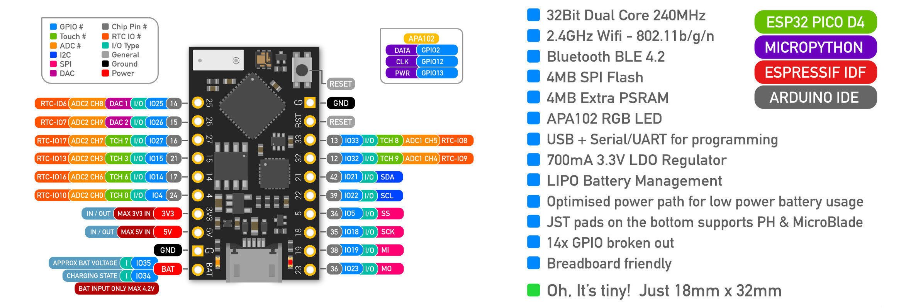

## Lecture 1: Introduction 
Embedded systems are becoming an increasingly tricky thing to precisely define. 
They are typically computing systems that exist embedded in a larger system, and 
they usually have one or more of the following properties:

* Real-time constraints: they must perform computation with predictable guarantees on execution time
* Power constraints: they are often battery-powered so need to consume as little power as possible.
* Application-specific: they generally do just a single specific task.

This course takes a practical approach to teaching embedded systems. 

There are two main components to this module: 
* The lectures -- where I will tinker with and explore hardware from my ~~bedroom~~ lab, and show you over zoom.
* The labs -- where you will tinker with and explore hardware and embedded software from your home.

### The Labs
We will use and work with an embedded device frequently used by the maker community, the ESP32. 
This marvellous little device has built-in WiFi, Bluetooth BLE, seriously low low-power modes, 
and is easily programmable from the Arduino IDE. 

We will also be using some tools for debugging and inspecting this hardware. 
In particular a USB logic analyser.

This will allow us to see pins being toggled and various protocol signals in real-time using [PulseView](https://sigrok.org/wiki/PulseView).

Now, given the current situation we unfortunately cannot invite you into the lab to play with these devices.
However, fear not, we have found a way that we can still effectively teach you practical embedded system development in a remote fashion.
Each of you will work in paris to remotely connect to hardware located in our embedded system lab.
From the safe comfort of your own home you will be able to program the device, inspect it's output,
and communicate with the wider network.

### The lectures

In the lectures I will use the following hardware:

| __pic__                            | __hardware__ |
|------------------------------------|--------------|
|                | A Hantek USB Oscilloscope             |
|              | A cheap function generator            |
|              | The same USB logic analyser that you'll be using in the labs             |
|              | The same TinyPico ESP32 development board that you'll be using in the labs             |
|            | A PYNQ FPGA development board from Xilinx  |
|             | Circuit.js a web based circuit simulator   |
|       | Verilator, a cycle-accurate hardware simulator |
|         | GTKWave, a digital hardware waveform viewer |

During the lectures, and by completing the labs, you will learn:

* How to write embedded software, taking into considerations various constraints, such as latency or power. 
* Hardware and software interfaces (converting between analog and digital)
* How bus communication protocols enable different devices to communicate
* What a real-time operating system is, how it works, and how to use one.
* How the choice of mathematical data types can influence both performance and power
* A brief introduction into custom hardware development and the use of FPGAs in embedded systems
* How to develop systems that can operate fault-free in extreme environments (such as space)

## Embedded systems are everywhere
During lecture 1 I will discuss how embedded systems are everywhere. 
We will then void some warranties and attempt to hack my childs smart baby monitor.

## Notes from the lecture

